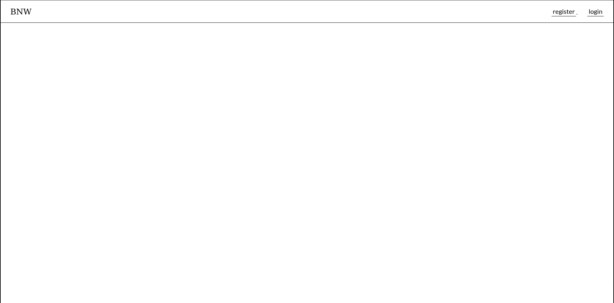
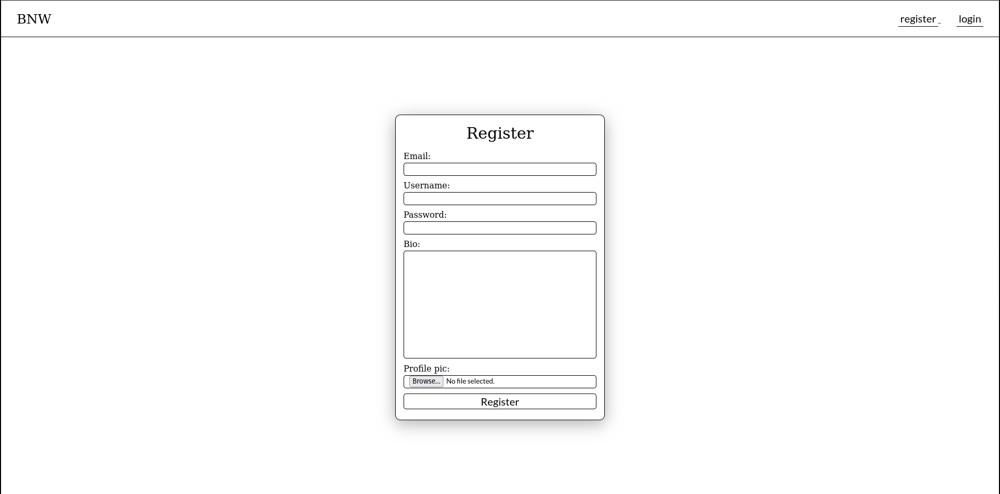
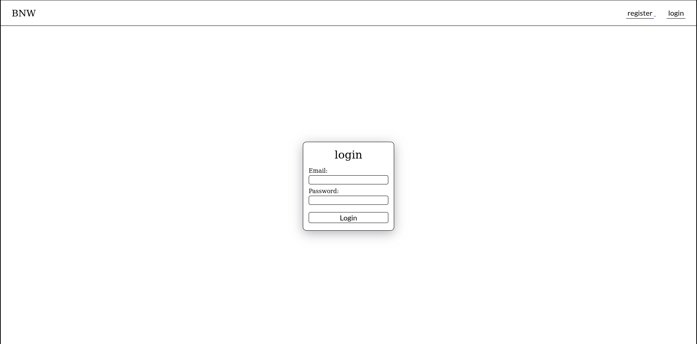
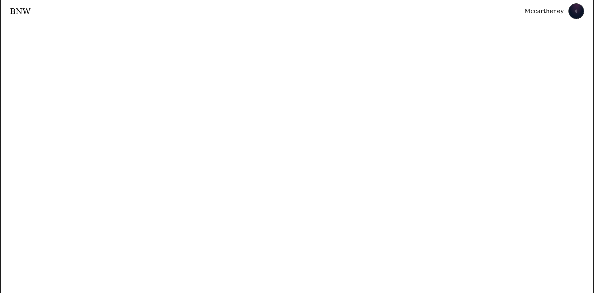
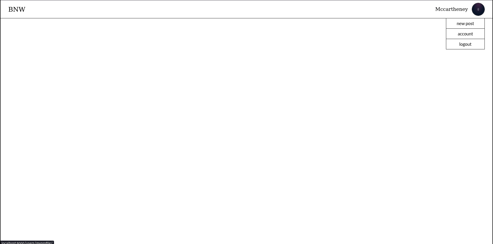
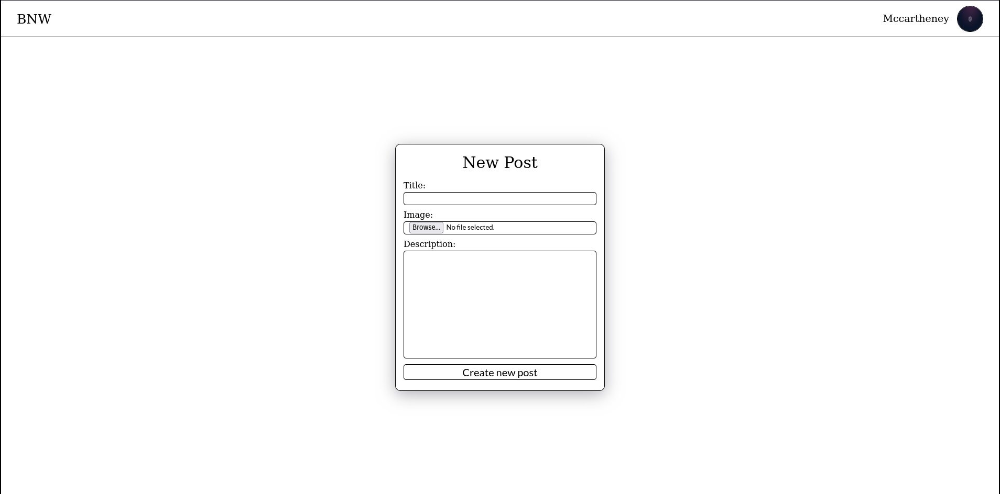
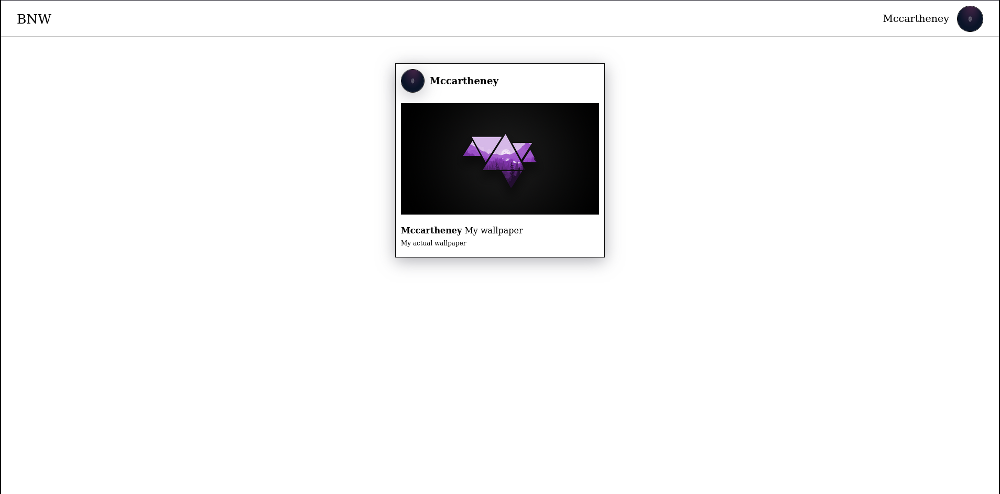
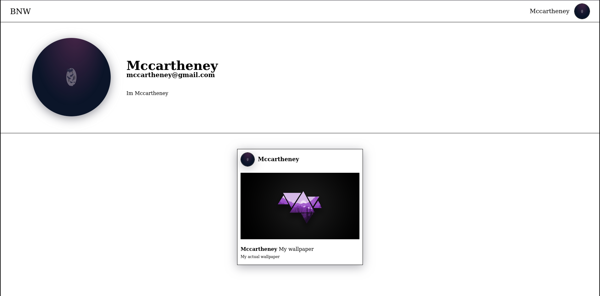
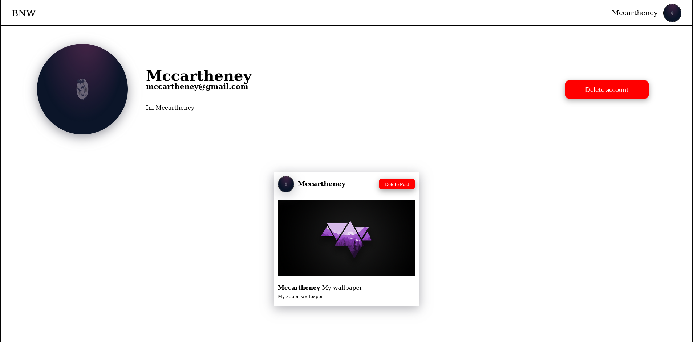

# WNB-django-blog
WNB Blog is a Django project. Developed as the final assignment for ETIC Algarve's Backend 1 module 

# Table of contents

1. [Todo](#todo)
2. [Technologies](#technologies)
3. [Requirements](#requirement)
4. [Installation](#installation)
5. [Screenshots](#screenshots)
6. [Useful Links](#useful-links)
7. [Justification for Framework Choice](#justification-for-framework-choice)
8. [Developers](#developers)
9. [License](#license)

# todo

## Frontend
- [✔] create html pages
    - [✔] condition rendering in html pages
    - [✔] page for user
    - [✔] page for register user
    - [✔] page for login user
    - [✔] page for main landing
        - [✔] show posts in html pages

- [✔] create stylization for html pages with sass

## Backend 
- [✔] config app to accept static files and media too

- [✔] Create views
    - [✔] blog_wnb
    - [✔] posts
    - [✔] users

- [✔] Create urls 
    - [✔] blog_wnb
    - [✔] posts
    - [✔] users

- [✔] Create models 
    - [✔] posts models
    - [✔] custom user model

- [✔] Create custom forms 
    - [✔] create custom form for posts
    - [✔] create custom forms for users

- [✔] create authentication for users

- [✔] add and remove posts
- [✔] remove users

# Technologies

### Frontend
- HTML
- Sass
- JavaScript

### Backend
- Django

### Project Functionality
- Docker and Docker-compose
- Makefile
- Poetry

# Requirements

To work with WNB Django Blog, ensure you have the following installed:

- **Python**: The project is built using Python. You can download and install Python from the [official Python website](https://www.python.org/downloads/).

- **Poetry**: Poetry is used for dependency management. You can install Poetry by following the instructions on the [Poetry website](https://python-poetry.org/docs/#installation).

- *(Optional)* **Docker**: Docker is optional but recommended for containerized deployment of the application. You can download and install Docker Desktop from the [official Docker website](https://www.docker.com/get-started).


# Installation

## Installation

To get started with WNB Django Blog, follow these steps:

### 1. Clone the repository

```bash
git clone https://github.com/mccartheney/WNB-django-blog.git
```

### 2. Navigate to the project directory

```bash
cd WNB-django-blog
```

## Run locally

### 3. Set up the application

```bash
make run-install
```

### 4. Run the application 

```bash
make run
```

## Run with Docker

### 3. Set up and run the application

```bash
make install-run-docker
```

### 4. Run the application 

```bash
make run-docker
```

<br/>
 This will start the development server, and you can access the application at http://localhost:8000.
<br/>
<br/>


# Screenshots

### Not logged user page


### Register page


### Login page


### Logged home page


### Options in logged home page 


### Create post page


### Home page with posts
If you click on username on post, you will be redirected to post user profile (Public profile page)


### Public profile page


### Private profile page


# Justification for Framework Choice

The choice of [Django](https://www.djangoproject.com/) as the framework for this project was based on several technical considerations:

- **Rapid Development:** Django offers a comprehensive set of tools and functionalities that enable rapid and efficient development of web applications.
  
- **Security:** Django comes with built-in security features, such as protection against SQL injection and cross-site scripting (XSS) attacks, which help ensure the security of the application.

- **Scalability:** Django is highly scalable, allowing the application to grow as needed to handle larger volumes of traffic and content.

- **Abundant Documentation:** Django's extensive documentation provides detailed resources and practical examples that facilitate learning and development with the framework.


# Developers
- [Mccartheney Mendes](https://github.com/mccartheney)

# License
This project is licensed under the [MIT License](/LICENSE)